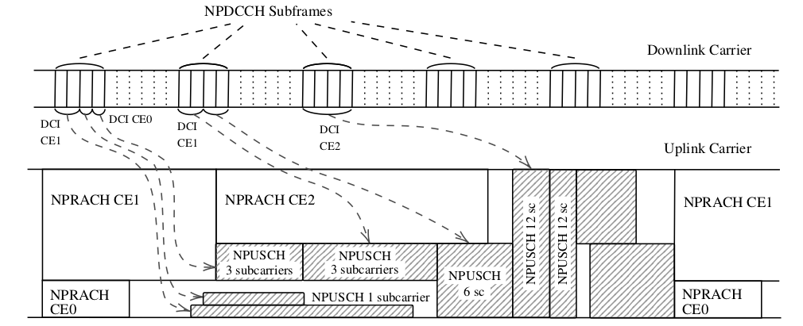
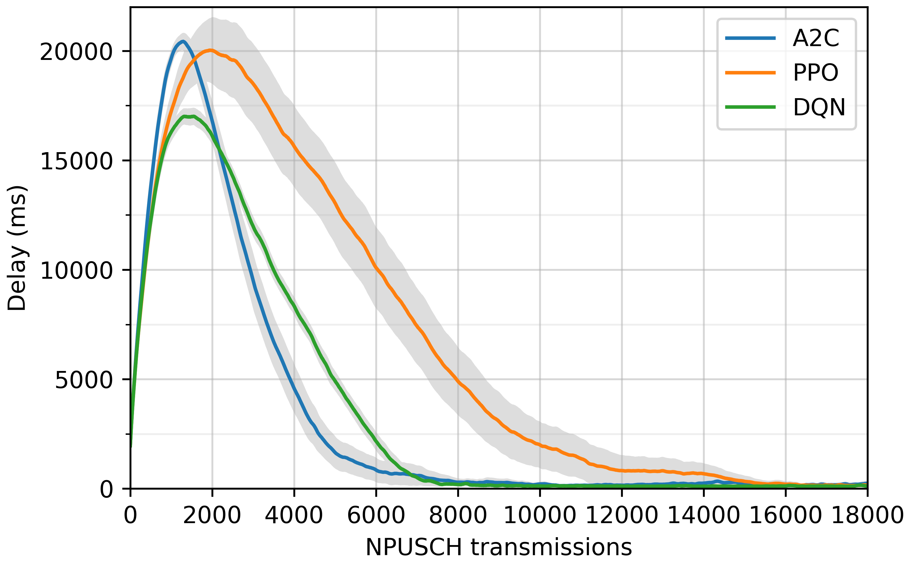
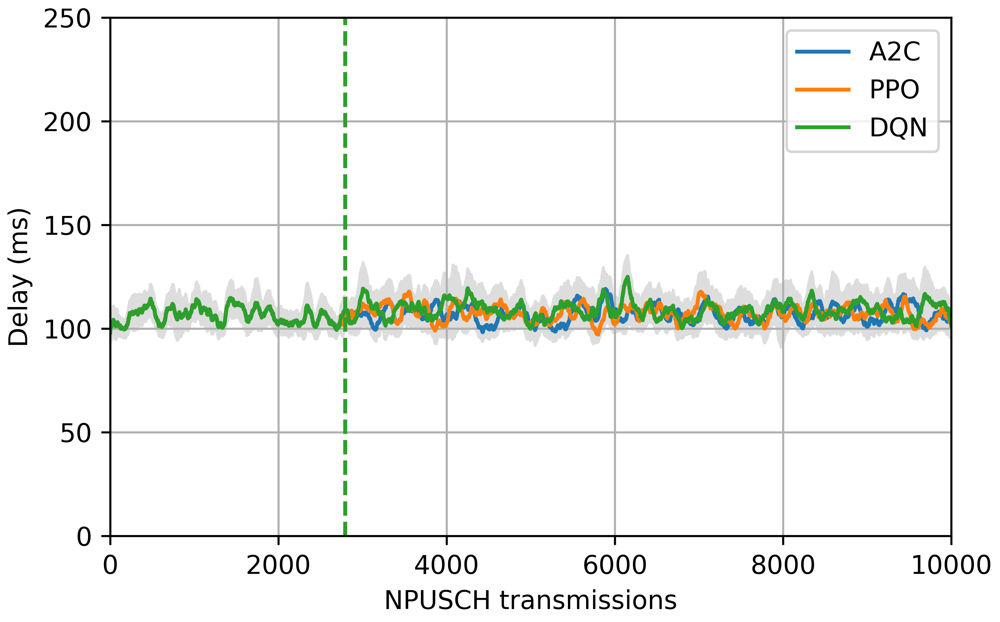

# NB-IoT environment

## Description

Source code of a [Narrowband Internet of things](https://en.wikipedia.org/wiki/Narrowband_IoT) (NB-IoT) environment and a multi-agent model-based RL (MAMBRL) agent for uplink transmission control in an NB-IoT access network. The NB-IoT environtment implements the [OpenAI Gym](https://github.com/openai/gym) interface and can interact with [Stable-Baselines](https://github.com/hill-a/stable-baselines) RL agents.



The objective of the control agent is to schedule and determine the link-adaptation parameters of NB-IoT uplink transmissions. The MAMBRL agent can learn on the system in operation without any previous knowledge (online learning), and without noticeably degrading the performance of the system during the learning process. In contrast, model-free RL agents (such as DQN, PPO, etc) increase the transmission delay by several orders of magnitude during the initial stages of the learning episodes.

## Acknowledgements

This work was supported by Grant PID2020-116329GB-C22 funded by MCIN / AEI / 10.13039/501100011033  


## How to use it

### Requirements

The enviroment requires Open-AI gym, Numpy and Pandas packages. The RL agents are provided by stable-baselines (version 2, which uses TensorFlow), and the scripts for plotting the results use scipy and matplotlib. The following versions of these packages are known to work fine with the environment:  

gym==0.15.3  
numpy==1.19.1  
pandas==0.25.2  
stable-baselines==2.10.1  
tensorflow==1.9.0  
scipy==1.5.4  
matplotlib==3.3.4

To run the MAMBRL agent, the scikit-multiflow library (https://scikit-multiflow.github.io) is required:  

scikit-multiflow==0.5.3

It is recommended to use a python virtual environment to install the above packages.

### Instalation

1. Clone or download the repository in your local machine

2. Open a terminal window and (optionally) activate the virtual environment

3. Go to the gym-system folder in the terminal window 

4. Once in the gym-system folder run:
```python
pip install -e .
```

### Basic use

The notebook [NBIoT_documentation.ipynb](NBIoT_documentation.ipynb) contains a step-by-step description of how to build a NB-IoT environment and run experiments with it using different agents including stable-baselines and our MAMBRL algorithm.

### Experiment scripts

There are four scripts for launching simulation experiments:

- experiments_single_RL.py: runs the experiments with the RL agents of stable-baselines  
- experiments_MARL.py: runs the experiments with two cooperative RL agents in a multi-agent (MA) architecture. 
- experiments_NBLA_RL.py: runs the experiments using an NBLA agent for link-adaptation in a MA architecture. 
- experiments_MAMBRL.py: runs the experiments using the proposed MBRL agent for link-adaptation in a MA architecture.

And one script plot_results.py, that plots the NPUSCH transmission delays over time averaged over several learning episodes. For example ```python plot_results.py 3 1``` plots the following figure showing the NPUSCH transmission delay obtained with model-free RL agents:

 

And ```python plot_results.py 1 1``` plots the following figure showing the delay obtained with the proposed MAMBRL controller:

 

## Project structure

The following files implement the environment:  

- node_b.py  
- carrier.py  
- channel.py  
- event_manager.py
- message_switch.py
- population.py
- user.py
- ue_generator.py
- action_reader.py
- access_procedure.py
- rx_procedure.py
- action_reader.py
- utils.py
- parameters.py
- perf_monitor.py
- ./gym-system/gym_system/environment.py

The MAMBRL agent is implemented in:

- controller.py: defines the multi-agent architecture
- agents.py: defines the model-based agent for link-adaptation and the NBLA baseline

The following files are required to run the experiments:

- test_utils.py
- wrappers.py
- scenarios.py

## How to cite this work

The code of this repository:

@misc{net_slice,  
    title={NB-IoT environment},  
    author={Juan J. Alcaraz},  
    howpublished = {\url{https://github.com/jjalcaraz-upct/nb-iot-environment/}},  
    year={2023}  
}

## Licensing information

This code is released under the MIT lisence.
