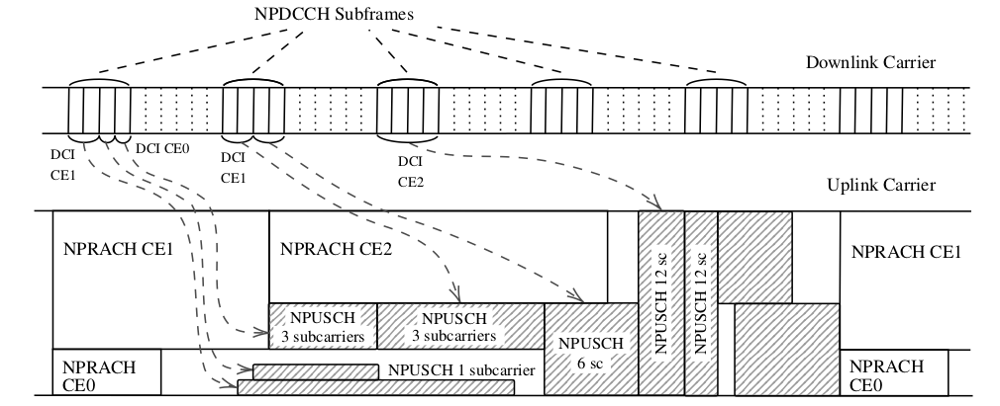

# NB-IoT environment

## Description

Source code of a [Narrowband Internet of things](https://en.wikipedia.org/wiki/Narrowband_IoT) (NB-IoT) environment for experimenting with reinforcement learning (RL) agents. The environment implements the NB-IoT physical layer and the medium access control (MAC) in a radio cell, whose decisions can be controlled by one or more agents. To do this, it must be determined which specific parameters or actions each agent controls. The environment also implements the Farama Foundation's [Gymnasium](https://gymnasium.farama.org) interface, and can interact with [Stable-Baselines3](https://stable-baselines3.readthedocs.io/en/master/) RL agents.



## Acknowledgements

This work was supported by Grant PID2020-116329GB-C22 funded by MCIN / AEI / 10.13039/501100011033  


## Use case examples

This environment has been used to develop new approaches for using RL in the control of NB-IoT functionalities.

### Random acess and coverage extension control
The paper [Random Access Control in NB-IoT with Model-Based Reinforcement Learning](./manuscript/MBRL_for_NPRACH.pdf) (under review) presents a model-based RL agent that dynamically allocates resources to the random access channels (NPRACH) of each coverage extension (CE) level, while configuring the power level thresholds that determine the coverage area of each CE level. Compared to state-of-the-art mode-free RL agents (A2C, PPO), the model-based approach is capable of operating efficiently (i.e. with a small delay) even in the early stages of learning.

### Uplink transmission control
The journal paper [Transmission Control in NB-IoT with Model-Based Reinforcement Learning](https://ieeexplore.ieee.org/abstract/document/10147823/) presents a new multi-agent model-based RL (MAMBRL) proposal to schedule and determine the link-adaptation parameters of uplink transmissions. MAMBRL can learn on the system in operation without any previous knowledge (online learning), and without noticeably degrading the performance of the system during the learning process. It is compared to model-free RL agents (such as DQN, PPO, etc) whcih are much less sample-efficient and thus present higher transmission delay during initial stages of the learning episodes.

## How to use the NB-IoT environment

### Requirements

The enviroment requires the Gymnasium, Numpy and Pandas packages. The RL agents are provided by stable-baselines (version 2, which uses TensorFlow), and the scripts for plotting the results use scipy and matplotlib. The following versions of these packages are known to work fine with the environment:  

gymnasium==0.29.1 
numpy==1.24.2 
pandas==1.4.2
stable-baselines3==2.1.0
torch==2.0.1
scipy==1.10.1
matplotlib==3.5.2

### Instalation

1. Clone or download the repository in your local machine

2. Open a terminal window and (optionally) activate the virtual environment

3. Go to the gym-system folder in the terminal window 

4. Once in the gym-system folder run:
```python
pip install -e .
```

### Basic use

The notebook [NBIoT_documentation.ipynb](NBIoT_documentation.ipynb) contains a step-by-step description of how to build a NB-IoT environment and run experiments with it.

### Experiment scripts

The scripts to replicate the results in [Random Access Control in NB-IoT with Model-Based Reinforcement Learning](./manuscript/MBRL_for_NPRACH.pdf) can be found in the ```./scripts_nprach``` folder. In order to run them, they must be moved to the root folder. 
There are two scripts:
- experiments_RL.py: runs the experiments with the RL agents of stable-baselines3
- experiments_MBRL.py: runs the experiments with the MBRL agents

The scripts to replicate the results in [Transmission Control in NB-IoT with Model-Based Reinforcement Learning](https://ieeexplore.ieee.org/abstract/document/10147823/) can be found in the ```./scripts_npusch``` folder. In order to run them, they must be moved to the root folder. 

There are four scripts for launching simulation experiments:

- experiments_single_RL.py: runs the experiments with the RL agents of stable-baselines  
- experiments_MARL.py: runs the experiments with two cooperative RL agents in a multi-agent (MA) architecture. 
- experiments_NBLA_RL.py: runs the experiments using an NBLA agent for link-adaptation in a MA architecture. 
- experiments_MAMBRL.py: runs the experiments using the proposed MBRL agent for link-adaptation in a MA architecture.

## Project structure

The the ./system folder contains the implementation of the environment which consistis of the following files:  

- node_b.py  
- carrier.py  
- channel.py  
- event_manager.py
- message_switch.py
- population.py
- user.py
- ue_generator.py
- action_reader.py
- access_procedure.py
- rx_procedure.py
- action_reader.py
- utils.py
- parameters.py
- perf_monitor.py
- system_creator.py

The ```./gym-system``` folder contains the code for building a gym-compatible environment 

The root folder contains:

- controller.py: orchestrates the multi-agent architecture
- control_agents.py: defines the basic agents
- agent_nprach.py: defines the agents for NPRACH control
- agent_dqn.py: implements a generic DQN agent based on [CleanRL](https://github.com/vwxyzjn/cleanrl)
- agent_dqn_nprach.py: implements a multi-agent DQN for NPRACH control
- agent_npusch: defines the agents for NPUSCH control
- wrappers.py: diverse wrappers for interacting with stable-baseline3 agents
- scenarios.py: defines simulation scenarios

## How to cite this work

The code of this repository:

@misc{net_slice,  
    title={NB-IoT environment},  
    author={Juan J. Alcaraz},  
    howpublished = {\url{https://github.com/jjalcaraz-upct/nb-iot-environment/}},  
    year={2024}  
}

The paper presenting the MBRL algorithm for NPRACH-CE level control:

@article{alcaraz2023transmission,  
    title={Random {Access Control} in {NB}-{IoT} {with} {Model}-{Based} {Reinforcement} {Learning}},  
    author={Juan J. Alcaraz, Juan-Carlos Sanchez-Aarnoutse, Alejandro-Santos Martínez-Sala and Francisco-JavierGonzalez-Casta{\~n}o},  
    journal = {Internet of Things Journal},  
    publisher = {IEEE},
    year={Under review}  
}

The paper presenting the MAMBRL algorithm for uplink transmission control:

@article{alcaraz2023transmission,  
    title={Transmission {Control} in {NB}-{IoT} {with} {Model}-{Based} {Reinforcement} {Learning}},  
    author={Juan J. Alcaraz, Fernando Losilla, and Francisco-JavierGonzalez-Casta{\~n}o},  
    journal = {IEEE Access},  
    publisher = {IEEE},
    pages = {57991--58005},
    volume = {11},
    year={2023}  
}

## Licensing information

This code is released under the MIT lisence.
